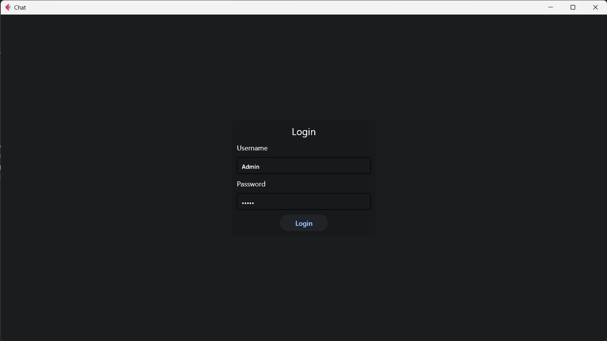
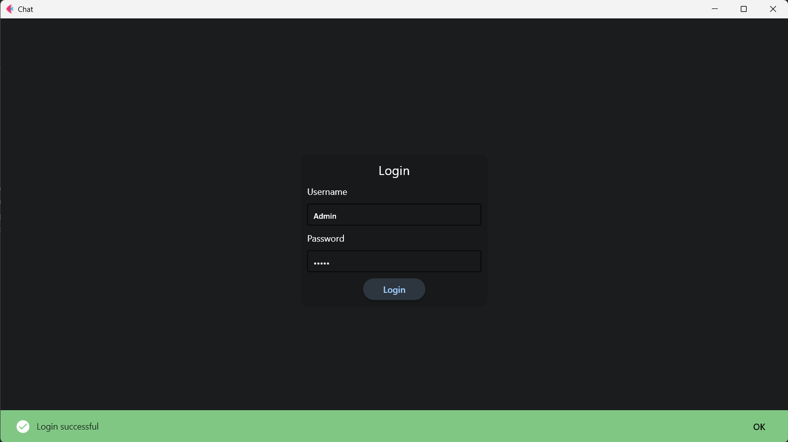
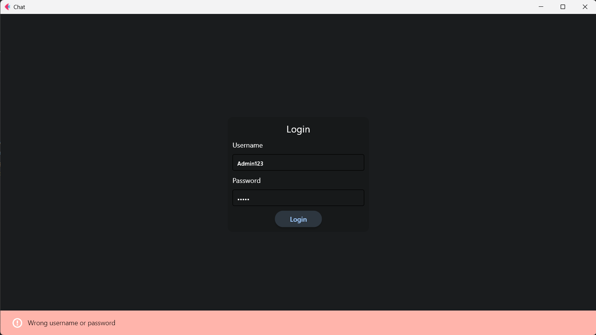

# Using Flet-mvc to create App

To create a new app, run this command
<pre>py .\flet_mvc_app.py <i>appname</i></pre>

To create a Component you need to run this command, where the type of component can be
<ul>
    <li>Model (model) (m)</li>
    <li>View (view) (v)</li>
    <li>Controller (controller) (c)</li>
</ul>

<pre>py .\flet_ceate.py <i>appname</i> <i>type_of_componente</i> <i>component_name</i> </pre>
This example will create a Model with the name <b>Person</b> inside the folder /<b>models</b> of the App <b>chat</b>
<pre>py .\flet_ceate.py chat model Person</pre>

<strong>Note:</strong> We need to provide the name of the App because you can have many app inside the folder

## Test Chat example

To test the chat app, you need to create a database with the same name as the dbname variable in the config file and set the correct data in config file

You can use the SQL file <i>chat.sql</i> to create the database

## Result
The login page look like

When th login botton is clicked, if the username and password are correct, you will see a success alert

When th login botton is clicked, if the username and password are wrong, you will see a error alert

